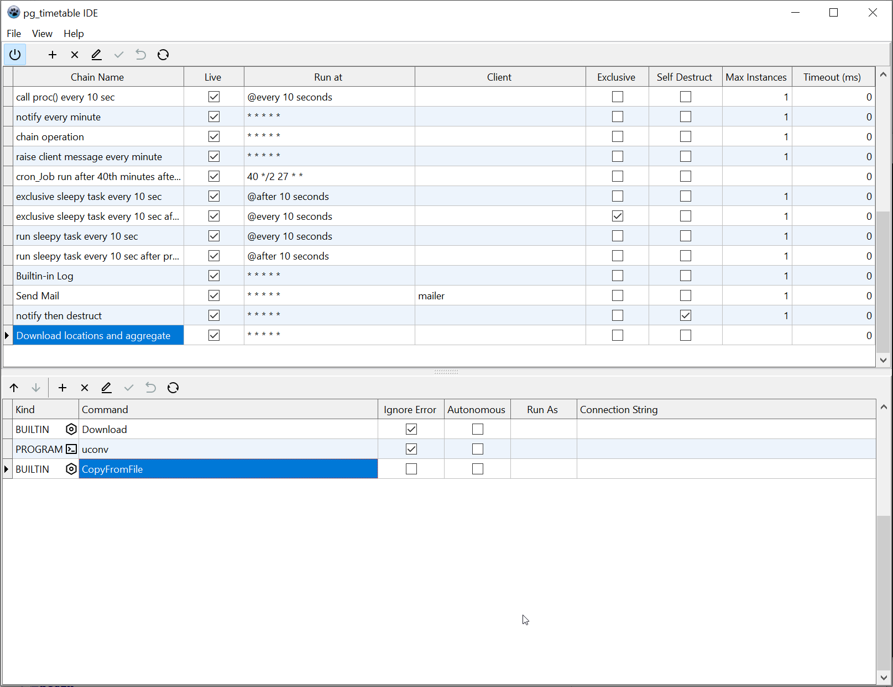

# pg_timetable_gui: IDE for [pg_timetable](https://github.com/cybertec-postgresql/pg_timetable) scheduler

**pg_timetable_gui** is a free cross-platform tool for developers and administrators, who need to work with advanced PostgreSQL [pg_timetable](https://github.com/cybertec-postgresql/pg_timetable) scheduler. While every operation can be done in a preferred PostgreSQL client (e.g. psql, pgadmin, dbeaber) we found that special tool may increase productivity during creating, debugging and monitoring jobs.

Enhanced description of chain and task properties can be found in the official [pg_timetable manual](https://pg-timetable.readthedocs.io/en/master/).

## Controls
 - connect/disconnect to the target PostgreSQL database

 - add chain/task

 - delete chain/task

 - edit current chain/task

 - post chain/task changes to the database

 - cancel editing chain/task

 - refresh chain/task list

 - move task up in the chain order

 - move task down in the chain order

## Main features
- List database chains and tasks ✅
- Add/update/delete chains and tasks ✅
- Change task order within the chain ✅
- Execute arbitrary SQL script from file
- Enhanced *cron-syntax* editor
- Enhanced task editor with debugging functionality

## Contributing

If you want to contribute to **pg_timetable_gui** and help make it better:
- ⭐[give a star][star] to the project,
- feel free to open an 🤚[issue][issue] or even
- consider submitting a 📜[pull request][PR].

[issue]: https://github.com/cybertec-postgresql/pg_timetable_gui/issues
[PR]: https://github.com/cybertec-postgresql/pg_timetable_gui/pulls
[star]: https://github.com/cybertec-postgresql/pg_timetable_gui/stargazers

## Support

For professional support, please contact [Cybertec](https://www.cybertec-postgresql.com/).

## Credits
- Author: [Pavlo Golub](https://github.com/pashagolub)
- Media: open-source [RemixIcons](https://remixicon.com/) set
